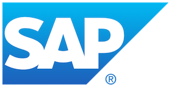

 

  

  <h3 align="center">Nest.land Hacktoberfest 2020</h3>

  

    Growth <i>hacking</i> the Deno Ecosystem
 

  

    
    
  

> Not currently accepting submissions. We'll be accepting incoming PRs starting on October 23rd!

This repository serves as a project and participant registry for our Hacktoberfest 2020 event. Any contributions you make to Deno projects or modules you create **must** have a pull-request, with the necessary information provided, into this repository. Without a pull-request, you will not be considered for the various available rewards.

## The Event

We're so excited to be hosting a Deno and Profit Sharing Communities Meetup on October 23rd with speakers: Ryan Dahl, Sam Williams, and Michael Spengler. You'll also have the opportunity to connect with other members of our community after the session!

[**Sign up here!**](https://organize.mlh.io/participants/events/5363-nest-land-hacktoberfest-online-meetup-with-ryan-dahl-sam-williams-and-michael-spengler)

Join our community on [Discord](https://discord.gg/hYUsX3H) and follow [@nestdotland](https://twitter.com/nestdotland) and [@deno_land](https://twitter.com/deno_land) on Twitter!

### Agenda

1. 1 PM Berlin Time: SAP Employee development kickoff
2. October 23rd at 12 PM ET: Hacktoberfest Event - Deno & Profit Sharing Communities
3. Start building!
4. October 26th at 11 AM ET: No longer accepting submissions

### Speakers

- [Ryan Dahl](https://github.com/ry) - Creator of Deno and Node
- [Sam Williams](https://github.com/samcamwilliams) - Founder and CEO of Arweave
- [Michael Spengler](https://github.com/michael-spengler) - Developer at SAP

## Participate

### Build a Deno module

Complete a Deno module and publish it to Nest.land **and** Deno.land/x.

Extra points will be awarded to modules that meet the following criteria:

- Complete or leverage [web3](https://nest.land/package/web3)
- Complete or leverage [nlp](https://nest.land/package/nlp)
- Build a canvas module for Deno

### Boy Scout Tour

Pick any Nest.land or Deno.land/x module you like and leave it in better condition than you found it by raising a **beneficial** PR on its repository.
[Boy Scout Rule](https://medium.com/@biratkirat/step-8-the-boy-scout-rule-robert-c-martin-uncle-bob-9ac839778385)

## Rules

### Build a Deno module

- You **CAN** submit a module that you already published
- You must submit a PR conforming to the template provided in this repository
- The module must be published to Nest.land and Deno.land/x
  - If you are building a module that has been accepted as a part of Deno's Standard Library, you do not need to additionally publish it to Nest.land, as we run an [STD mirror](https://nest.land/std)
- The module must be created originally by you or your team
- The module must not contain malicious or inappropriate files

### Boy Scout Tour

- You must submit a PR conforming to the template provided in this repository
- Your contributions must be sufficiently beneficial to the module
- Your PR to the module repository must be accepted and merged

> The Nest.land and Deno.land Organizations reserve the right to disqualify a user or module for any reason.

## In Collaboration With

## Copyright

Nest.land is licensed under the MIT license. Please see the [LICENSE](../LICENSE) file.
