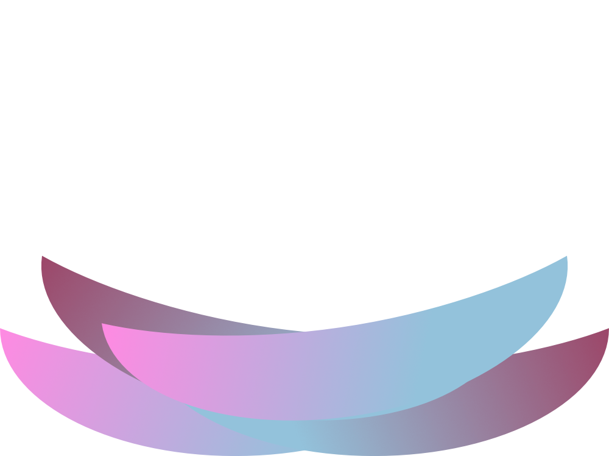

 

  

  <h3 align="center">Nest.land Hacktoberfest 2020</h3>

  

    Growth-Hacking the Deno Ecosystem
 

## Nest.land Hacktoberfest 2020

## What is nest.land?

Nest.land combines Deno with the [Arweave](https://arweave.org). With us, you can publish your Deno modules to the permaweb, where they can never be deleted. This avoids a major pitfall for web-based module imports while allowing developers to leverage Deno's import design!

## Speakers

- [Ryan Dahl](https://github.com/ry)
- [Sam Williams](https://github.com/samcamwilliams)
- [Michael Spengler](https://github.com/michael-spengler)

## In Collaboration With:

## Copyright

Nest.land is licensed under the MIT license. Please see the [LICENSE](../LICENSE) file.
